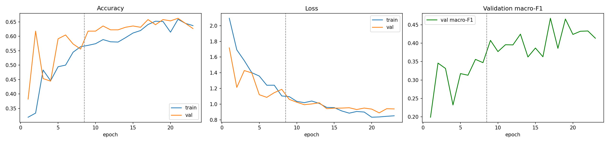
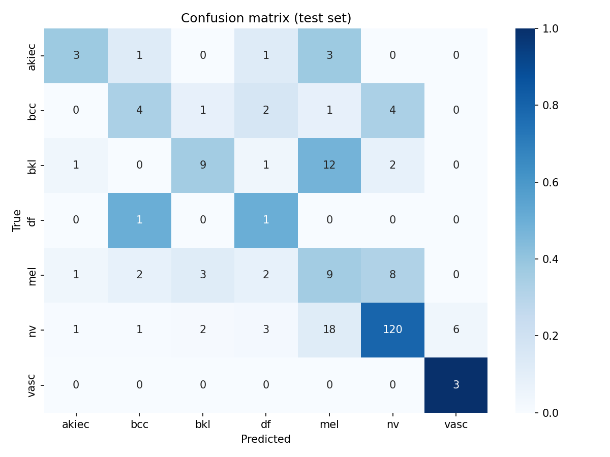
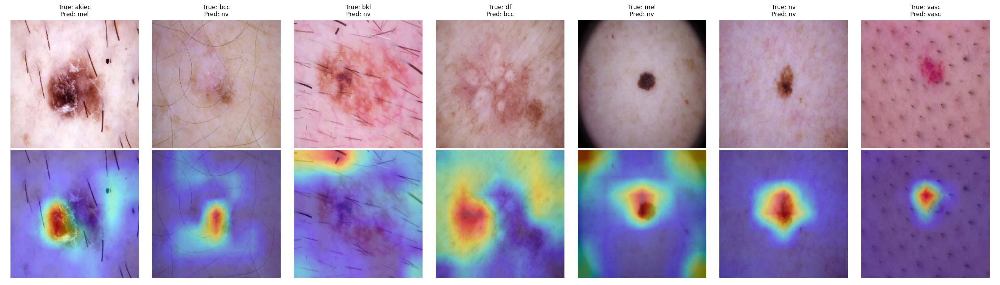

# Skin Disease Classification using CNN (EfficientNetB0)

Multi-class classification of skin lesion images into 7 classes (akiec, bcc, bkl, df, mel, nv, vasc) using an ImageNet-pretrained EfficientNetB0 with transfer learning and fine-tuning (Keras / TensorFlow), plus Grad-CAM explainability.

## Reference paper
K. Ali, Z. A. Shaikh, A. A. Khan, A. A. Laghari, "Multiclass skin cancer classification using EfficientNets – a first step towards preventing skin cancer," *Neuroscience Informatics*, vol. 2, no. 4, p. 100034, 2022. https://doi.org/10.1016/j.neuri.2021.100034

The paper fine-tunes EfficientNets B0–B7 (ImageNet weights) on HAM10000 and reports EfficientNet B0 at 83.02% top-1 accuracy / 82% F1, and B4 (best) at 87.91% / 87%.

## This implementation vs. the paper
| | Paper | This project |
|---|---|---|
| Dataset | Full HAM10000 (10,015 images) | Reduced set (~1,500 images), same 7 classes |
| Model | EfficientNet B0–B7 | EfficientNetB0 |
| Augmentation | Rotation, zoom, horizontal/vertical flip | Same |
| Preprocessing | Hair removal (blackhat + inpainting) | Resize only |
| Classification head | Dense 512 → BN → Dropout → Dense 256 → BN → Dropout → Dense 7 | GAP → Dropout → Dense 256 → Dropout → Dense 7 |
| Fine-tuning | All layers, SGD (B0–B5) | Two-phase: train head, then unfreeze top 40 layers (Adam, low LR, BatchNorm frozen) |
| Class imbalance | Imbalance-aware metrics | Class weights + macro-F1 model selection |
| Extra | - | Grad-CAM |

## Method
- Stratified 70/15/15 train/val/test split (test set used once at the end)
- Augmentation inside the model (flip, rotation, zoom), re-randomised every epoch
- Best checkpoint chosen by validation macro-F1 (accuracy is misleading on imbalanced data)
- Evaluation: accuracy, per-class precision/recall/F1, confusion matrix, Grad-CAM

## Run
1. Open the notebook in Google Colab (badge above) and set Runtime > Change runtime type > **T4 GPU**.
2. Run all cells. When asked, upload the dataset zip (one folder per class).
3. Results and plots are saved as `training_curves.png`, `confusion_matrix.png`, `gradcam.png`.

## Results
| Model | Test Accuracy | Macro-F1 |
|---|---|---|
| EfficientNetB0 (fine-tuned) | _fill in_ | _fill in_ |

## Limitations
- Small dataset; rare classes (df, vasc, akiec) have very few test images, so their metrics are noisy.
- Folder-based data has no lesion IDs, so the same lesion may appear in more than one split.
- Educational project. **Not a medical diagnostic tool.**
